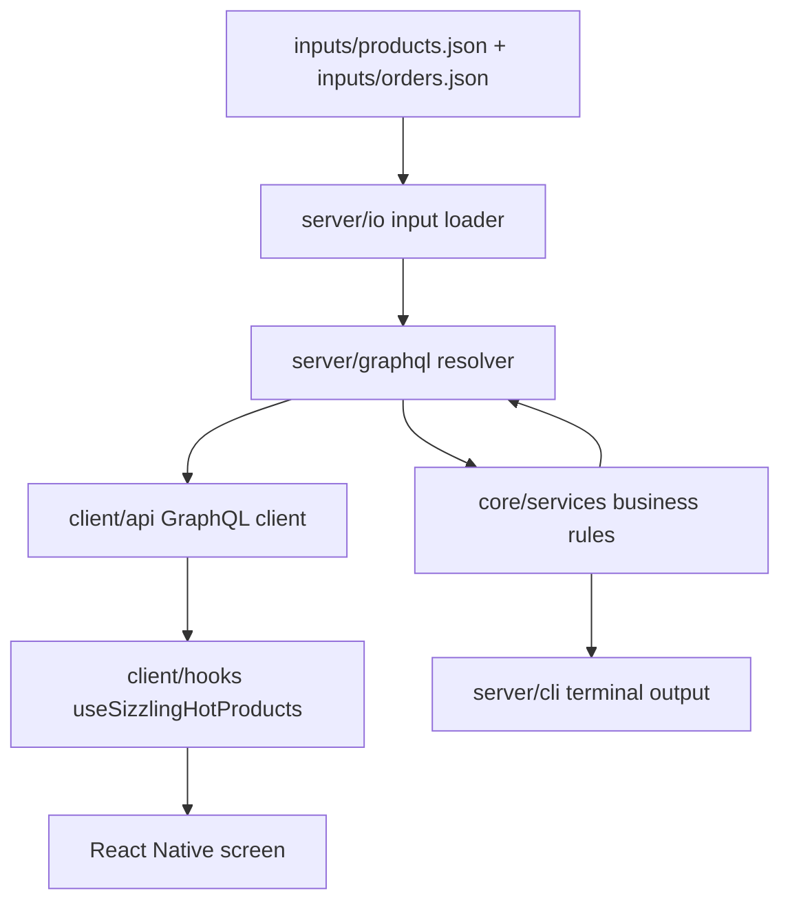

# Sizzling Hot Products

React Native, Node.js, and GraphQL solution for calculating the Bunnings Sizzling Hot Products results from JSON order and product data.

## Stack

- React Native / Expo
- Node.js
- TypeScript
- GraphQL
- Jest

## Project Structure

- `src/client`: Expo app, React Native components, assets, API client, and data hook.
- `src/server`: GraphQL API, input loader, logger, and CLI entry point.
- `src/core`: shared domain types, date helpers, and business rules.
- `inputs`: supplied `products.json` and `orders.json` files.
- `test`: backend, GraphQL, and frontend tests.
- `docs`: architecture, assumptions, testing notes, trade-offs, and workflow notes.

## Documentation

- [Architecture](docs/architecture.md)
- [Assumptions](docs/assumptions.md)
- [Testing](docs/testing.md)
- [Design decisions and trade-offs](docs/tradeoffs.md)
- [Git workflow](docs/workflow.md)

## Architecture



## How To Run

Install dependencies:

```bash
npm install
```

Run all local checks:

```bash
npm run check
```

Run the GraphQL API first:

```bash
npm run api
```

Then start Expo in another terminal:

```bash
npm start
```

The mobile app fetches product data from the local GraphQL API. If Expo is started without the API running, the app will show a network error.

For a physical phone, set the API URL explicitly:

```bash
EXPO_PUBLIC_GRAPHQL_URL=http://YOUR_LAN_IP:4000/graphql npm start
```

## Useful Commands

```bash
npm run lint
npm run typecheck
npm test
npm run cli
npm run cli -- --json
```

Test the GraphQL endpoint while `npm run api` is running:

```bash
curl -X POST http://127.0.0.1:4000/graphql \
  -H 'Content-Type: application/json' \
  --data '{"query":"{ sizzlingHotProducts { daily { date productId productName salesCount } period { startDate endDate productId productName salesCount } } }"}'
```

## Expected Output

| Date or Period          | Top Sizzling Hot Product                           |
| ----------------------- | -------------------------------------------------- |
| 21/04/2026              | Ezy Storage 37L Flexi Laundry Basket - White       |
| 22/04/2026              | Ezy Storage 37L Flexi Laundry Basket - White       |
| 23/04/2026              | Arlec 160W Crystalline Solar Foldable Charging Kit |
| 21/04/2026 - 23/04/2026 | Ezy Storage 37L Flexi Laundry Basket - White       |

## Notes

- The core business logic is in `src/core/services/sizzlingHotProductsService.ts`.
- The GraphQL API and CLI both call the same core service.
- The React Native app is a client of the GraphQL API and does not calculate the results itself.
- The server caches loaded JSON inputs for the lifetime of the process.
