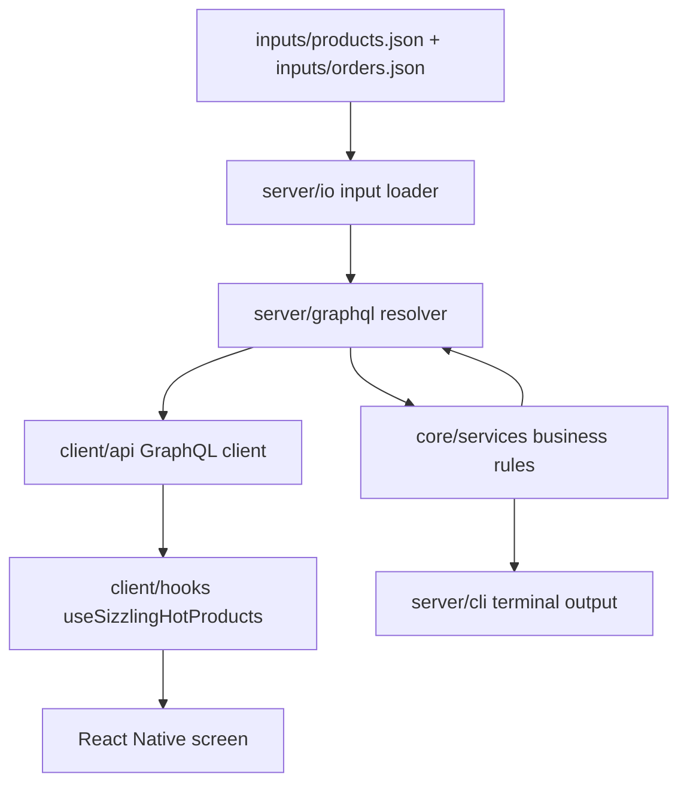

# Architecture

The project is split into client, server, and shared core code.

## Folders

- `src/client`: Expo / React Native UI, assets, API client, and data-loading hook.
- `src/server`: Node.js GraphQL server, input loading, logger, and CLI entry point.
- `src/core`: shared domain types, date helpers, and business rules.
- `inputs`: source JSON files supplied by the challenge.
- `test`: backend, GraphQL, and frontend Jest tests.

## Request Flow

1. The Expo app starts in `App.tsx`.
2. `useSizzlingHotProducts` calls the frontend GraphQL client.
3. The client posts a GraphQL query to the local Node API.
4. The GraphQL resolver loads cached input data and calls the core service.
5. The service applies cancellations, deduplication, date ranges, and tie-breaking.
6. The GraphQL response is rendered by the React Native components.

## CLI Flow

The CLI uses the same core service as the GraphQL API. It exists so reviewers can verify the expected output without opening the mobile app.
